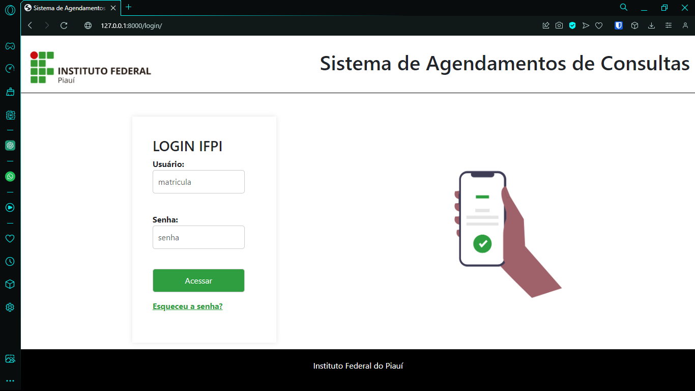
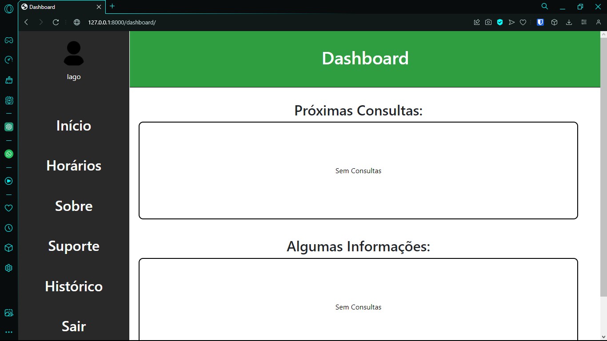

<h1 align="center"> PsyBot 🤖</h1>
<div align="center">
  


  
</div>


# Índices 🗂
* [Sobre](#sobre-)
* [Screenshots](#screenshots-)
* [Como usar](#como-usar-)
* [Links](#links-)

# Sobre ☄

Repositório para guardar o código fonte de um projeto integrador voltado para a criação de uma ferramenta de consultas para o setor de psicológia do IFPI campus Pedo II. <br>
O projeto não está finalizado. Apenas algumas funcionalidades foram implemtandas para a apresentação da disciplina que o projeto foi requerido.

### Funcionalidades implementadas:
- Sistema de login
- Função de primeiro login
- Sessões com cookies
- Ver horários
- Ver a proxima consulta
- Confirmar consulta (Psicologo(a))
- Ver o horario com os nomes dos alunos (Psicologo(a))
- Remarcar consulta caso (Psicologo(a))

<br>

# Screenshots 📸
<div display="inline" align="center">

### Alunos
<br>




<br>

## Psicológo(a)
<br>


<br>

</div>

# Como usar 💻

1. Instale o Python e a biblioteca do Django.

	Python: https://www.python.org/downloads/ <br>
	Django: https://docs.djangoproject.com/en/5.0/

<br>

2. Clone o Repositório do GitHub em sua respectiva máquina:
```shell
git clone https://github.com/danonep2/PsyBot
```

3. Execute os seguintes comandos para a criação do banco de dados SQLite e a criação dos super usuários 
	
    Comando para a criação do banco de dados:
    ```
	python manage.py migrate
    ```

	Comando para a criação do super usuário:
	```
    python manage.py createsuperuser
    ```
	
Após a execução do comando de criação de super usuário, o Django vai solicitar as credenciais que o super usuário deve conter.

<br>

4. Criando usuários
	A criação dos usuários é realizada manualmente ou por algum algorítimo interando uma tabela. Para realizar o cadastro dos usuários, utilize a rota de admin do próprio Django ou utilize algum programa que consiga gerenciar banco de dados e o abra com o arquivo ` “db.sqlite3” `.
	Ao realizar o cadastro dos usuários, verifique o campo “tipo”. Este campo distingue se o usuário criado foi destinado a um aluno(a) ou psicólogo(a). Os possíveis valores para este campo é “aluno” ou “psicologa”.
	Caso não seja informada uma senha para a criação do usuário, o sistema irá colocar a senha padrão, “Aluno@ifpi”. Quando o usuário realizar o seu primeiro acesso, o sistema irá redireciona-lo para uma página onde ele poderá definir uma nova senha de acesso.

5. Rodando o projeto<br>
	Para finalmente iniciar o projeto, abra no terminal no diretório onde contém o arquivo “manage.py”. Após chegar a pasta execute o seguinte comando:

    ```
	python manage.py runserve
    ```
	
	Após a execução do comando o projeto estará em execução no localhost de sua máquina (127.0.0.1).


# Links 🔗

Django: [Documentação](https://docs.djangoproject.com/en/5.0/) <br>
Documentação do projeto: [Link](https://drive.google.com/file/d/1TT1M2FT98Lk9odJvS09cIuxCNCFL6FQk/view?usp=sharing)

<hr>
<div align="center">

Criado por: <br>
[Iago Amorim](https://github.com/danonep2), [Milleny Mesquita](https://github.com/MillenyMesquita) e [Diego Pereira](https://github.com/Diegop33p2).

</div>
